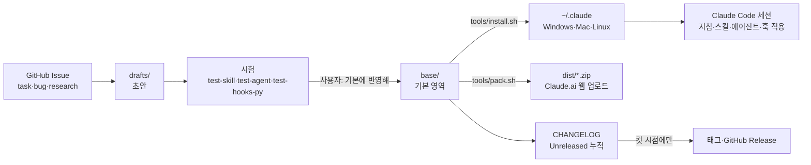

# 구성과 운영 흐름

README가 "무엇이 어디에 있는지"라면, 이 문서는 "그것들이 어떻게 이어지고 어떤 순서로 돌아가는지"를 적는다. 자산별 현재 단계와 기기별 설치 상태는 [PROGRESS.md §0](PROGRESS.md#0-자산-현황--단계와-배포-상태)이 원본이다.

## 한눈에 보기

## 구성 요소가 적용되는 곳

| 원본 | 설치 위치 | 적용 범위 |
| --- | --- | --- |
| [base/claude-md/CLAUDE.md](../base/claude-md/CLAUDE.md) | `~/.claude/CLAUDE.md` 웹은 Project instructions | 모든 저장소의 모든 세션 |
| [base/rules/](../base/rules/) | `~/.claude/rules/` | 모든 세션(주제별 규칙) |
| [base/skills/](../base/skills/) | `~/.claude/skills/` 웹은 `pack.sh` zip 업로드 | 사용자 말이 스킬 설명과 맞을 때 발동 |
| [base/agents/](../base/agents/) | `~/.claude/agents/` | Claude가 조사·점검·검사를 맡길 때 |
| [base/hooks/](../base/hooks/)·[base/settings.example.json](../base/settings.example.json) | `~/.claude/hooks/`, `~/.claude/settings.json`(키 병합) | 모든 세션, 아래 "훅이 도는 시점" |
| [.claude/](../.claude/) | 설치하지 않음 | 이 저장소 세션에서만 |
| [CLAUDE.md](../CLAUDE.md)·[docs/](./) | 설치하지 않음 | 이 저장소 작업 규칙과 기록 |

## 훅이 도는 시점

같은 시점에 걸린 훅은 동시에 돌고, 도구 호출은 가장 늦게 끝나는 훅을 기다린다. 훅이 많거나 느리면 작업 속도가 그만큼 느려진다. 그래서 필요한 명령에서만 도는 훅은 `if` 조건(권한 규칙 문법)으로 거르고, 기록만 하는 훅은 `async`로 백그라운드에서 돌려 기다리지 않는다([Issue #147](https://github.com/yanos0218/AI/issues/147)).

| 시점 | 전역 훅(`base/hooks/`) | 이 저장소 전용(`.claude/hooks/`) |
| --- | --- | --- |
| 세션 시작 | `session-start-check.sh` 설치 버전·저장소 표준·self-audit 안내·대량 조회 누적 확인 | - |
| 컴팩션 직전·직후 | `compact-snapshot.sh`·`compact-snapshot-show.sh` git 상태·최근 검사 명령 저장 후 보여줌 | - |
| 명령 실행 전(Bash) | `git-guardrails.sh` push·삭제 등 확인, 모든 명령 `gh-throttle.sh` GitHub 쓰기 명령 간격 조절, `gh`·`bash` 명령만 `format-guard.sh` 커밋·이슈·PR·릴리즈 본문 형식 검사, 위반이면 막음, `git`·`gh` 명령만 | `baseline-guard.sh` `base/` 쓰기 확인, 모든 명령 `pre-commit-check.sh` 커밋 전 문서·스크립트 검사, 이슈 번호 확인, `git`·`bash` 명령만 |
| 파일 편집 전(Edit·Write) | - | `baseline-guard.sh` |
| 명령·편집 뒤 | `config-changelog.sh` `~/.claude` 설정 변경 기록, 편집은 `~/.claude` 파일만, 백그라운드 `bulk-read-log.sh` 대량 조회 기록, 백그라운드 `md-format-check.sh` `.md`에 새로 쓴 부분의 목록 줄바꿈 검사, `.md` 편집만 | - |
| 답변 끝 | `usage-dashboard` 스킬의 `usage.sh hook` 토큰 사용 기록, 켜 뒀을 때만, 백그라운드 | `session-end-check.sh` 문서 갱신 누락 안내 |
| verifier 에이전트 안 | `verifier-guard.sh` 쓰기·커밋 명령 차단 | - |

- 초안을 시험하느라 임시로 등록한 훅은 PROGRESS §0 해당 행에 적는다.
- 저장소 전용 훅은 `${CLAUDE_PROJECT_DIR}` 기준 절대 경로로 등록한다. 상대 경로면 작업 폴더를 옮겼을 때 훅을 못 찾는다.
- `if` 조건은 명령 이름만 쓴다(`Bash(git *)`). `Bash(git commit *)`처럼 인자까지 쓰면 `$()`·heredoc이 든 명령에서 조건과 상관없이 발동해, 조건 여러 개가 같은 훅을 동시에 여러 번 띄운다(2026-09-28 실측 6개).
- `if` 조건의 `Write(**/*.md)` 같은 경로 규칙은 저장소 안 파일에만 맞는다(저장소 밖 `.md`는 안 걸림, 2026-09-28 실측).
- 판정이 복잡한 훅은 셸 입구가 대상 아닌 입력을 바로 끝내고, 파이썬 본체(`*_*.py`)와 공통 모듈 `hooklib.py`가 판정한다.

## 운영 흐름

### 1. 세션 하나

1. 시작하면 [HANDOFF.md](HANDOFF.md) → [PROGRESS.md](PROGRESS.md) §0 → 열린 Issue 순으로 읽는다.
2. 새 작업은 Issue부터 연다. 형식은 [issue-format.md](issue-format.md).
3. 작업 단위가 끝나면 로컬 커밋한다. `pre-commit-check.sh`가 검사하고, 커밋 메시지에는 `Refs #N`만 쓴다.
4. push는 사용자 확인 뒤에 한다. `git-guardrails.sh`가 확인 창을 띄운다.
5. 검증이 끝나면 `gh issue close`로 직접 닫는다.
6. 끝낼 때 HANDOFF 현재 상태와 PROGRESS §0을 갱신한다.

### 2. 새 자산 만들기

1. 계획
   - Issue(`task`)만 있다. 새 기본 영역 자산이면 설계를 채팅에 제시하고 승인받는다.
2. 초안
   - [drafts/](../drafts/README.md)에 만든다.
3. 검증
   - 스킬은 [tools/test-skill.sh](../tools/test-skill.sh), 에이전트는 [tools/test-agent.sh](../tools/test-agent.sh), 훅은 시험 스크립트와 실제 명령으로 시험한다. 결과는 Issue 댓글과 PROGRESS §0에 남긴다.
4. 기본
   - 사용자가 "기본에 반영해"라고 하면 `base/`로 옮기고 `install.sh`로 이 기기에 설치한다.

### 3. 기기·웹 반영

- 다른 기기는 다음 접속 때 `bash tools/install.sh`(또는 어느 저장소에서든 "설정 업데이트해줘").
- 설치 뒤 `bash tools/check-install.sh`로 원본과 같은지 확인한다.
- 웹은 `bash tools/pack.sh`로 만든 zip을 Claude.ai에 올린다. 절차는 [install.md](install.md).

### 4. 릴리즈 컷

- 기본 영역 변경은 [CHANGELOG.md](../CHANGELOG.md) `[Unreleased]`에 쌓아 둔다.
- 컷은 다른 기기·웹 설치 직전, 월 점검, 사용자 요청 때만 한다. 규칙은 [versioning.md](versioning.md), 절차는 `dev-release` 스킬.

### 5. 정기 점검

- 매달 첫 세션에 [monthly-check.md](monthly-check.md) 체크리스트를 제안하고, 사용자가 "점검하자"라고 하면 진행한다.
- 대화 방식 점검은 `self-audit` 스킬로 한다(비용이 들어 사용자 요청 때만).
